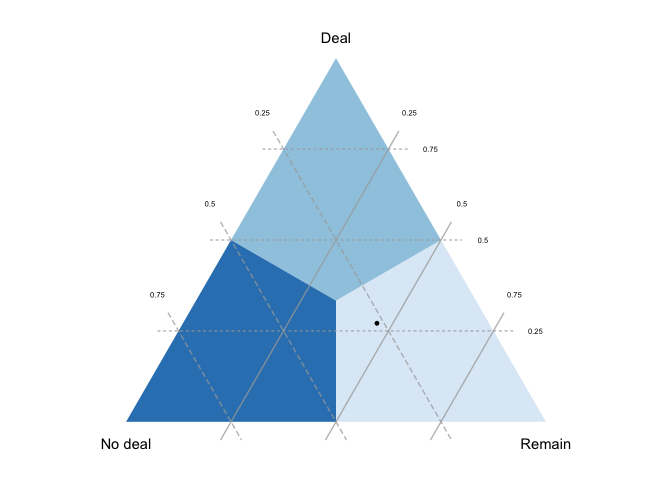
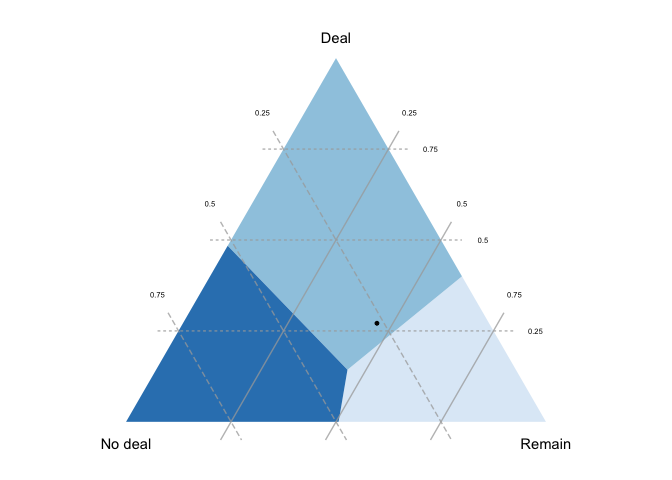
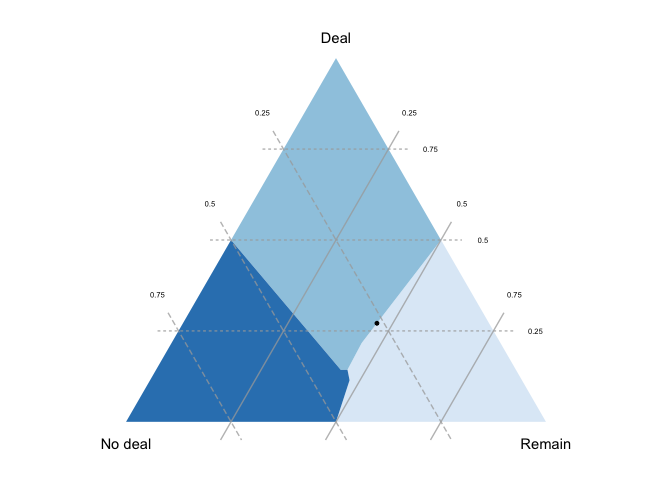
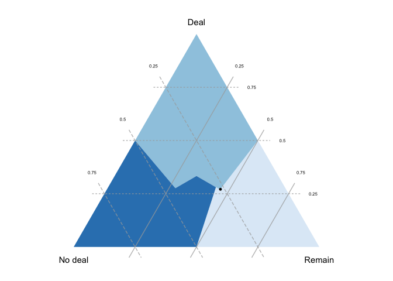

<!-- README.md is generated from README.Rmd. Please edit that file -->

# votevizr

<!-- badges: start -->

<!-- badges: end -->

The `votevizr` package helps you make diagrams to better understand
election results in *ordinal voting systems*, a class that includes

  - [positional
    methods](https://en.wikipedia.org/wiki/Positional_voting), including
      - plurality
      - Borda count
      - anti-plurality
  - [Condorcet methods](https://en.wikipedia.org/wiki/Condorcet_method),
    with many ways of resolving cycles
  - [ranked-choice
    voting](https://en.wikipedia.org/wiki/Instant-runoff_voting) (aka
    RCV, instant-runoff voting/IRV, alternative vote/AV, single-winner
    STV, preferential voting)

`votevizr` implements the methods I develop in [this
paper](https://doi.org/10.1007/s00355-020-01274-y) published in [*Social
Choice and Welfare*](https://www.springer.com/journal/355). The paper
explains the figures in detail and discusses previous attempts to
represent election results in ternary diagrams.

## Installation

To install from GitHub:

``` r
devtools::install_github("aeggers/votevizr")
```

## Example

The package includes two datasets, `brexit_prefs` and `sf_result`. Each
dataset is just a named list containing frequencies for each preference
ordering over three alternatives.

We load the Brexit poll results:

``` r
library(votevizr)
#> Loading required package: magrittr
data(brexit_prefs)
brexit_prefs
#> $`Remain > Deal > No deal`
#> [1] 0.375
#> 
#> $`No deal > Deal > Remain`
#> [1] 0.228
#> 
#> $`Deal > No deal > Remain`
#> [1] 0.212
#> 
#> $`Remain > No deal > Deal`
#> [1] 0.087
#> 
#> $`Deal > Remain > No deal`
#> [1] 0.059
#> 
#> $`No deal > Remain > Deal`
#> [1] 0.038
```

Now we make some figures. Let’s start with plurality:

``` r
brexit_prefs %>% 
  qplot_votevizr(split = " > ", method = "plurality")
```



Each vertex of the triangle represents an election result where one
alternative is ranked first by all voters; the closer you get to a
vertex, the larger that alternative’s share of *first preferences*
(i.e. top rankings). The black dot represents the actual result:
“Remain” was ranked first most often (on just under 50% of ballots),
while “Deal” and “No deal” were each ranked first on just over 25% of
ballots.

Each colored region identifies the first-preference results where a
given candidate would win. In plurality the outcome depends only on
first preferences, so these regions are symmetrical.

If we move to Borda count, the *first-preference win regions* become
asymmetrical:

``` r
brexit_prefs %>% 
  qplot_votevizr(split = " > ", method = "Borda")
```



This is because (unlike plurality) Borda count gives points for being
ranked second, and “Deal” was ranked second on most ballots; given this
pattern of lower preferences, “Deal” would win a Borda count election
even if it was well below a plurality of first-preference votes.

Note that the figure assumes the pattern of *second preferences* (lower
rankings) is fixed: as we move away from the dot, we see what would have
happened if e.g. “Remain” had won more first-preference votes but the
proportion of “Remain” voters listing “Deal” second (vs. “No deal”) was
held fixed.

With Condorcet methods, the winner is determined by checking each pair
of candidates: a candidate who is ranked higher than each other
candidate by a majority is the winner. In the Brexit case, we
essentially have a tie between “Remain” and “Deal”:

``` r
brexit_prefs %>% 
  qplot_votevizr(split = " > ", method = "Condorcet")
```


Note that there is an area with no winner: this is where a [Condorcet
cycle](https://en.wikipedia.org/wiki/Condorcet_paradox) takes place,
with “Remain” beating “Deal”, “Deal beating”No deal“, and”No deal"
beating “Remain”. `votevizr` allows several ways of resolving such a
cycle. Here is the Kemeny-Young method:

``` r
brexit_prefs %>% 
  qplot_votevizr(split = " > ", method = "Condorcet", if_cycle = "kemeny")
```



Finally we have ranked-choice voting:

``` r
brexit_prefs %>% 
  qplot_votevizr(split = " > ", method = "RCV")
```



## Vignettes

`vignette("votevizr_overview")` gives a more detailed overview of the
package focusing on the `qplot_votevizr()` method.

`vignette("under_the_hood")` shows what is happening “under the hood”,
which is useful if you want more plotting flexibilty than
`qplot_votevizr()` provides.
